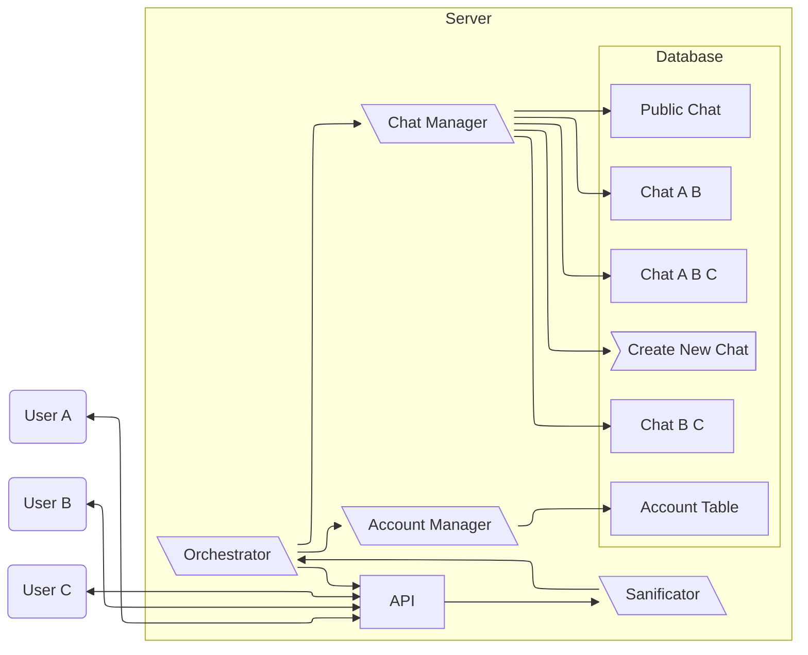

## API Endpoints

### Authentication
- `POST /api/auth/register`: Register a new user.
  - **Body**: `{ "username": "user", "password": "password" }`
- `POST /api/auth/login`: Login and retrieve a token.
  - **Body**: `{ "username": "user", "password": "password" }`
- `GET /api/users/list`: Get all users.
  - **Response**: `[{"username": "user1"}, {"username": "user2"}, ...]`
- `GET /api/users/list/{chat_id}`: Get all users in a chat.
  - **Response**: `[{"username": "user1"}, {"username": "user2"}, ...]`
- `POST /api/users/search`: Search for users.
  - **Body**: `{ "query": "user" }`
  - **Response**: `[{"username": "user1"}, {"username": "user2"}, ...]`

### Chat Management
- `GET /api/chats`: List all chats the user is part of.
- `POST /api/chats`: Create a new chat.
  - **Body**: `{ "name": "Group Chat", "participants": ["user1", "user2"] }`
- `GET /api/chats/{chat_id}`: Get details of a specific chat.

### Chat Editing
- `PATCH /api/chats/{chat_id}`: Update chat details (e.g., name).
  - **Body**: `{ "name": "New Name" }`
- `POST /api/chats/{chat_id}/participants`: Add a participant.
  - **Body**: `{ "username": "new_user" }`
- `DELETE /api/chats/{chat_id}/participants/{username}`: Remove a participant.

### Messaging
- `GET /api/chats/{chat_id}/messages`: Get message history for a chat.
- `POST /api/chats/{chat_id}/messages`: Send a message to a chat.
  - **Body**: `{ "content": "Hello world" }`