# Chatastic — Mobile App Documentation

Full explanation of the Android client from design, logic, and development perspectives.

---

## Table of Contents

1. [Project at a Glance](#1-project-at-a-glance)
2. [Design Perspective](#2-design-perspective)
   - 2.1 Visual Language
   - 2.2 Screen-by-Screen Breakdown
   - 2.3 Component Library
3. [Logic Perspective](#3-logic-perspective)
   - 3.1 Activity Flow & Navigation
   - 3.2 Authentication Flow
   - 3.3 Chat List Flow
   - 3.4 Real-time Messaging Flow
   - 3.5 Message Rendering Logic
   - 3.6 Data Models
4. [Development Perspective](#4-development-perspective)
   - 4.1 Project Structure
   - 4.2 Build Configuration
   - 4.3 Dependencies
   - 4.4 API Layer
   - 4.5 Session Management
   - 4.6 WebSocket Client
   - 4.7 RecyclerView Adapters
5. [Communication Protocol](#5-communication-protocol)
   - 5.1 REST Endpoints
   - 5.2 WebSocket Protocol

---

## 1. Project at a Glance

**App name:** Chatastic
**Package:** `com.danieletoniolo.Chatastic`
**Language:** Java (source); Kotlin DSL for Gradle build files
**Min SDK:** 24 (Android 7.0)
**Target/Compile SDK:** 35 (Android 15)
**Java compatibility:** 1.8

Chatastic is the Android client for the RPiChat system. It connects to a self-hosted FastAPI backend (typically running on a Raspberry Pi) over HTTP for REST calls and WebSocket for live messaging.

---

## 2. Design Perspective

### 2.1 Visual Language

The app follows a **brutalist dark aesthetic**: high-contrast black/white on dark grey backgrounds, square/rectangular shapes, bold typography, and no decorative elements. This keeps the UI legible on small screens and intentionally avoids the rounded, colourful conventions of mainstream messaging apps.

#### Colour palette (`res/values/colors.xml`)

| Name | Hex | Usage |
|------|-----|-------|
| `dark_bg` | `#303030` | Main screen background |
| `darker_bg` | `#212121` | Message input bar background |
| `white` | `#FFFFFF` | Text, icons, borders, avatars |
| `black` | `#000000` | Text on light bubbles |
| `light_gray` | `#BDBDBD` | Default message bubble fill |
| `mid_gray` | `#757575` | Placeholder/hint text |

Message bubbles override the default grey:
- Outgoing (me): `#DCF8C6` — soft green
- Incoming (other): `#FFFFFF` with a `#E0E0E0` border

#### Typography

All text is rendered in the system default font. Sizes used:
- Screen titles: `24sp`
- Input fields / action buttons: `20sp`
- Chat/message body text: `16–18sp`
- Sender label: `11sp` bold
- Timestamp: `10sp`

#### Theme (`res/values/themes.xml`)

The theme extends `Theme.AppCompat.NoActionBar` — no system action bar is shown on any screen. The window background defaults to `dark_bg`. All drawables and colours are set to match the dark palette.

---

### 2.2 Screen-by-Screen Breakdown

#### Login Screen (`activity_login.xml`)

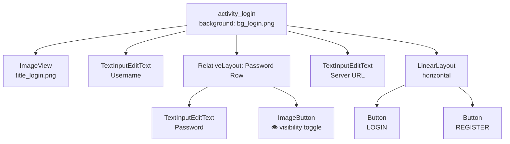

- Background: wavy blob PNG (`bg_login.png`) sourced from the Haikei design tool.
- Title: PNG image (`title_login.png`) containing the "A New Way to Chat" lettering.
- Three input fields with a white bottom-underline border (`bg_input_underline.xml`), no visible box.
- Password field has an eye (`ic_eye`) `ImageButton` overlaid in the right end of a `RelativeLayout` wrapper; tapping it toggles `PasswordTransformationMethod` / `HideReturnsTransformationMethod`.
- Two action buttons side by side, styled with `bg_button_square.xml` (transparent fill, 3dp white stroke).

#### Chat List Screen (`activity_chat_list.xml`)

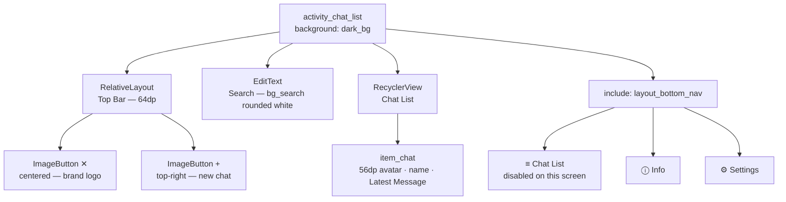

- Top bar: the centred `✕` icon is a non-navigating brand logo. The `+` button in the top-right opens the "Create New Chat" dialog.
- Search bar: white fill with 4dp rounded corners (`bg_search.xml`), black text. Currently a visual-only element — filtering is not implemented.
- Each chat row (`item_chat.xml`): 56×56dp white square avatar + chat name in 20sp white + "Latest Message" subtitle in 14sp mid-grey.
- Bottom nav: three equal-weight `ImageButton`s; the Chat List icon is disabled and dimmed on this screen.

#### Chat Screen (`activity_chat.xml`)

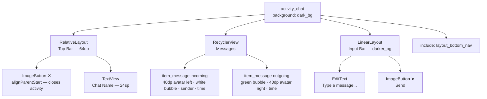

- `✕` button closes the activity (returns to the previous screen in the back-stack).
- Bubble width is `wrap_content` with `maxWidth="280dp"` — short messages stay compact. The `Gravity` of the parent `LinearLayout` per item is set to `END` or `START` to align bubbles left/right.
- Incoming: white bubble with border, avatar on left, sender name visible, timestamp bottom-right.
- Outgoing: green bubble, avatar on right, no sender label, timestamp bottom-right.

#### Settings Screen (`activity_settings.xml`)

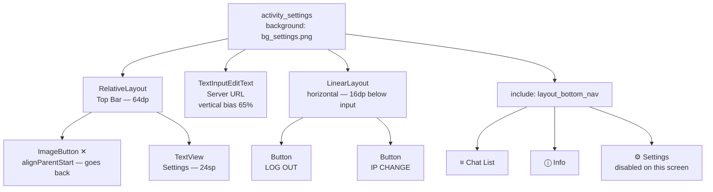

- Background: layered waves PNG (`bg_settings.png`).
- Server URL input sits at `constraintVertical_bias="0.65"` between the top bar and the bottom nav, placing it in the lower half of the screen as in the reference design.
- **Log out** clears the session and navigates to `LoginActivity`. **Ip change** saves the new IP and rebuilds the Retrofit client.

---

### 2.3 Component Library

#### `bg_button_square.xml`
Transparent rectangle with a 3dp white stroke. Used for all action buttons (Login, Register, Log out, Ip change, Send).

#### `bg_input_underline.xml`
Layer-list that shows only a bottom border (white, 2dp) by using negative left/right/top offsets. Used on all text inputs.

#### `bg_search.xml`
Solid white rectangle with 4dp corner radius. Used on the search bar in Chat List.

#### `bg_message_me.xml`
Light green (`#DCF8C6`) rectangle, rounded on three corners (top-left, bottom-left, bottom-right = 16dp; top-right = 0dp).

#### `bg_message_other.xml`
White rectangle with a 1dp grey border, rounded on three corners (top-right, bottom-left, bottom-right = 16dp; top-left = 0dp).

#### `layout_bottom_nav.xml`
Horizontal `LinearLayout` of height 64dp with background `#202020`. Three equal-weight `ImageButton` children using `ic_chat_list`, `ic_info`, and `ic_settings`. The active screen disables and dims its own icon programmatically.

---

## 3. Logic Perspective

### 3.1 Activity Flow & Navigation

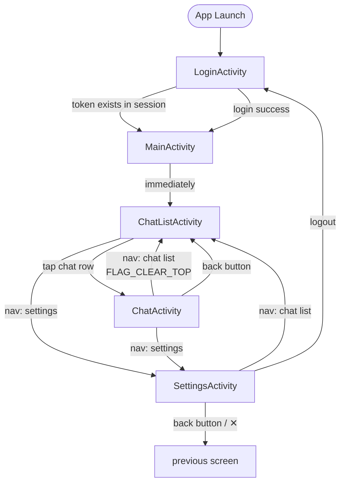

- `MainActivity` is a transparent relay: it immediately starts `ChatListActivity` and calls `finish()`. Its only purpose is to be the post-login Intent target, keeping routing logic out of `ChatListActivity`.
- All navigation uses explicit `Intent`s. There is no fragment-based navigation or NavGraph.
- `ChatActivity` → bottom nav → `ChatListActivity` uses `FLAG_ACTIVITY_CLEAR_TOP | FLAG_ACTIVITY_SINGLE_TOP` to prevent duplicate instances from stacking.

---

### 3.2 Authentication Flow

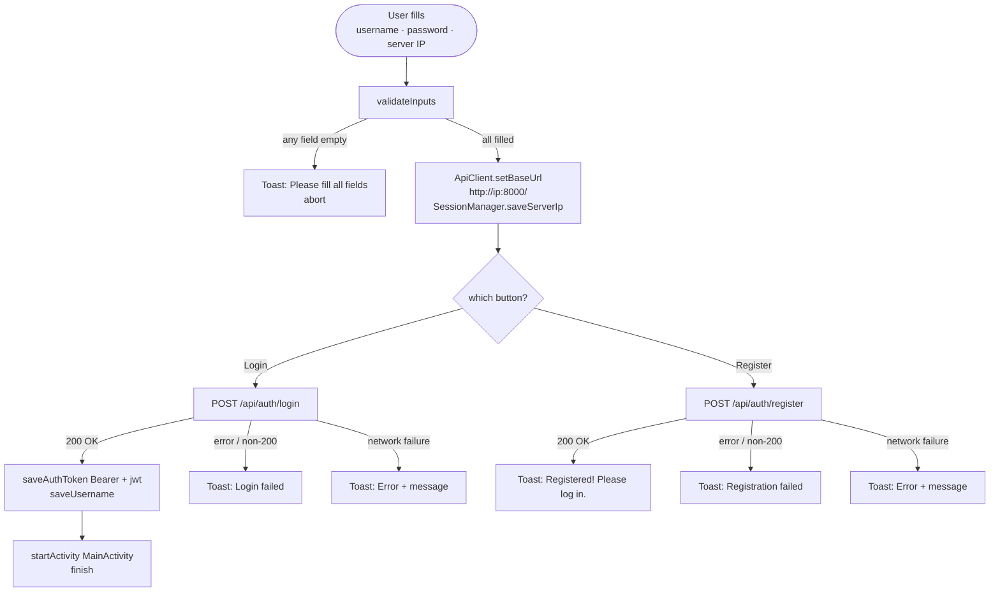

- The server IP is stored **without** scheme in `SessionManager`. On restart, `LoginActivity` reads it and calls `ApiClient.setBaseUrl()` before forwarding to `ChatListActivity`, so Retrofit always points at the right server.
- The token is stored as the full header value (`"Bearer <jwt>"`), ready to pass directly to `@Header("Authorization")` without further manipulation.
- Registration does **not** auto-login — the user must press Login afterwards.

---

### 3.3 Chat List Flow

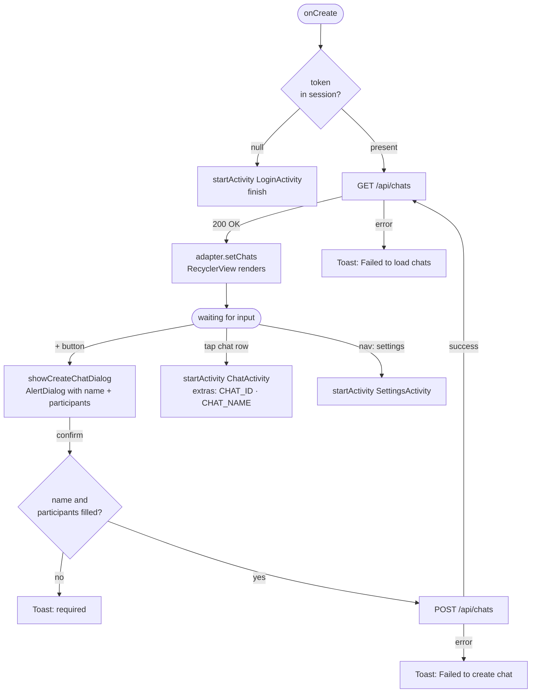

- The search `EditText` is visual-only — no text-change listener is attached; the list is not filtered.
- `ChatAdapter` is an inner class; each row click forwards `CHAT_ID` (int) and `CHAT_NAME` (String) as intent extras.

---

### 3.4 Real-time Messaging Flow

#### Startup & WebSocket lifecycle

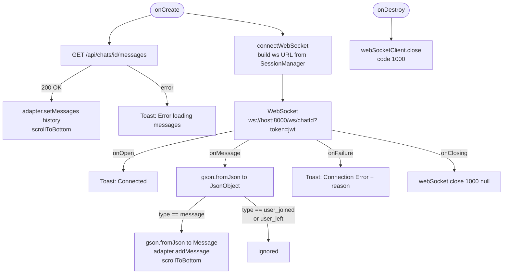

#### Sending a message

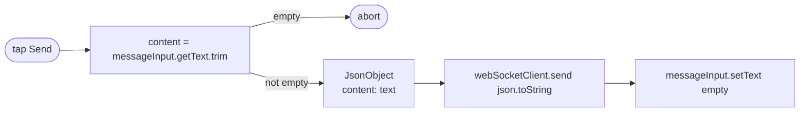

**Dual-source field handling in `Message.java`:**
The REST history endpoint returns `sender_username`; the WebSocket broadcast uses `sender`. Both fields carry `@SerializedName` annotations and `getSenderUsername()` returns whichever is non-null, so `MessageAdapter` works identically for both sources.

---

### 3.5 Message Rendering Logic

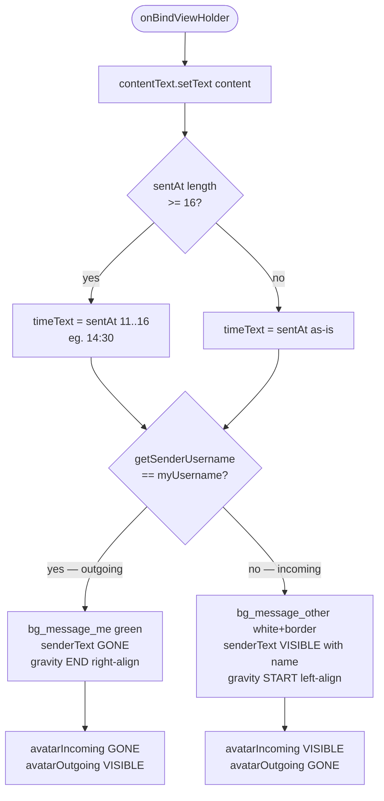

**Timestamp formatting:** ISO-8601 strings from the server (e.g. `"2026-03-27T14:30:00"`) are sliced at characters 11–16 to extract `HH:MM`.

---

### 3.6 Data Models

All model classes are plain POJOs in `model/`. Gson maps JSON keys to field names unless overridden by `@SerializedName`.

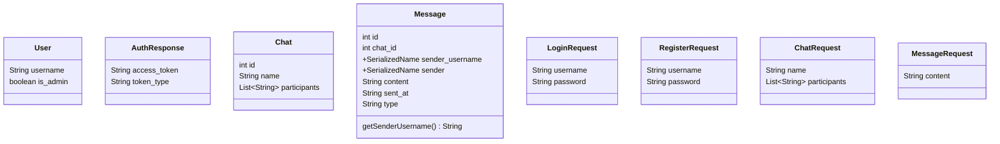

> `MessageRequest` is defined but unused — messages are sent as raw WebSocket JSON, not via REST.

---

## 4. Development Perspective

### 4.1 Project Structure

```
mobile/Chatastic/
├── app/
│   ├── src/main/
│   │   ├── java/com/danieletoniolo/Chatastic/
│   │   │   ├── MainActivity.java          ← splash/redirect
│   │   │   ├── LoginActivity.java         ← login + register
│   │   │   ├── ChatListActivity.java      ← chat list + inner ChatAdapter
│   │   │   ├── ChatActivity.java          ← chat view + inner MessageAdapter
│   │   │   ├── SettingsActivity.java      ← server IP + logout
│   │   │   ├── api/
│   │   │   │   ├── ApiClient.java         ← Retrofit singleton builder
│   │   │   │   ├── ApiService.java        ← Retrofit interface (REST endpoints)
│   │   │   │   ├── SessionManager.java    ← SharedPreferences wrapper
│   │   │   │   └── WebSocketClient.java   ← OkHttp WebSocket wrapper
│   │   │   └── model/
│   │   │       ├── User.java
│   │   │       ├── AuthResponse.java
│   │   │       ├── Chat.java
│   │   │       ├── Message.java
│   │   │       ├── LoginRequest.java
│   │   │       ├── RegisterRequest.java
│   │   │       ├── ChatRequest.java
│   │   │       └── MessageRequest.java
│   │   ├── res/
│   │   │   ├── layout/                    ← XML screen and item layouts
│   │   │   ├── drawable/                  ← Vector icons + shape backgrounds + PNGs
│   │   │   └── values/                    ← colors.xml, strings.xml, themes.xml
│   │   └── AndroidManifest.xml
│   └── build.gradle.kts
├── build.gradle.kts
├── settings.gradle.kts
└── gradle/libs.versions.toml
```

### 4.2 Build Configuration

**`app/build.gradle.kts`** (key settings):

```kotlin
compileSdk = 35
minSdk = 24
targetSdk = 35

compileOptions {
    sourceCompatibility = JavaVersion.VERSION_1_8
    targetCompatibility = JavaVersion.VERSION_1_8
}
```

Build commands (run from `mobile/Chatastic/`):

```bash
./gradlew assembleDebug            # Build debug APK → app/build/outputs/apk/debug/
./gradlew installDebug             # Build + install on connected device/emulator
./gradlew test                     # Run unit tests
./gradlew connectedAndroidTest     # Run instrumented tests (requires device/emulator)
```

**`AndroidManifest.xml`** — key declarations:

```xml
<uses-permission android:name="android.permission.INTERNET" />

<!-- Allows plain HTTP (needed for local Raspberry Pi without TLS) -->
<application android:usesCleartextTraffic="true" ...>

<!-- Entry point -->
<activity android:name=".LoginActivity">
    <intent-filter>
        <action android:name="android.intent.action.MAIN" />
        <category android:name="android.intent.category.LAUNCHER" />
    </intent-filter>
</activity>
```

### 4.3 Dependencies

| Library | Version | Purpose |
|---------|---------|---------|
| Retrofit | 2.9.0 | HTTP client with annotation-based API definition |
| OkHttp | 4.12.0 | Underlying HTTP client; also used directly for WebSocket |
| OkHttp Logging Interceptor | 4.12.0 | Logs HTTP request/response bodies (debug only) |
| Gson | 2.10.1 | JSON serialisation/deserialisation |
| Gson Converter (Retrofit) | 2.9.0 | Bridges Retrofit responses to Gson |
| Material Design | 1.11.0 | `TextInputEditText`, `AlertDialog.Builder` themes |
| ConstraintLayout | 2.1.4 | Flexible XML layouts |
| AppCompat | — | `AppCompatActivity` base class |

### 4.4 API Layer

#### `ApiClient.java`

A static singleton that holds a `Retrofit` instance. The base URL is mutable — calling `setBaseUrl()` nulls the existing instance, forcing a rebuild on the next `getClient()` call. This is how the app supports dynamic server addresses.

```java
// Force a new Retrofit instance pointing at a different server
ApiClient.setBaseUrl("http://192.168.1.50:8000/");
ApiService service = ApiClient.getClient();
```

The OkHttp client attached to Retrofit has a `BODY`-level logging interceptor. In production this should be downgraded to `NONE` or gated behind `BuildConfig.DEBUG`.

Default base URL is `http://10.0.2.2:8000/` — the AVD (emulator) alias for `localhost` on the host machine.

#### `ApiService.java`

Retrofit interface declaring all REST calls:

```java
@POST("/api/auth/register")           Call<User>          register(@Body RegisterRequest);
@POST("/api/auth/login")              Call<AuthResponse>  login(@Body LoginRequest);
@GET("/api/users/list")               Call<List<User>>    getUsers(@Header("Authorization") String);
@GET("/api/chats")                    Call<List<Chat>>    getChats(@Header("Authorization") String);
@POST("/api/chats")                   Call<Chat>          createChat(@Header("Authorization") String, @Body ChatRequest);
@GET("/api/chats/{chat_id}/messages") Call<List<Message>> getMessages(@Header("Authorization") String, @Path("chat_id") int);
```

All authenticated endpoints receive the token as the full `Authorization` header string (`"Bearer <jwt>"`). All calls use `.enqueue(Callback<T>)` — Retrofit dispatches callbacks on the main thread.

### 4.5 Session Management

`SessionManager` wraps a `SharedPreferences` file named `"ChatasticSession"`. It is the single source of truth for logged-in state.

| Key | Type | Default | Description |
|-----|------|---------|-------------|
| `access_token` | String | null | Full `"Bearer <jwt>"` value |
| `username` | String | null | Logged-in user's username |
| `server_ip` | String | `"10.0.2.2"` | IP (no scheme, no port) of the backend |

`clear()` removes all keys — this is the logout mechanism called from `SettingsActivity`.

The server IP is stored **without** scheme or port. Both `ApiClient` (`http://`) and `connectWebSocket()` (`ws://`) append the scheme and port `:8000` programmatically, keeping the stored value clean and reusable.

### 4.6 WebSocket Client

`WebSocketClient` is a thin wrapper around OkHttp's `WebSocket` API:

```java
connect(String url, WebSocketListener listener)  // opens connection
send(String text)                                // sends a text frame
close()                                          // closes with code 1000
```

The listener is implemented inline in `ChatActivity.connectWebSocket()`. Callbacks are dispatched to the main thread via `runOnUiThread()`. The socket is closed in `ChatActivity.onDestroy()` to prevent leaks.

The WebSocket URL is built from `SessionManager` at connection time:

```
ws://<serverIp>:8000/ws/<chatId>?token=<jwt>
```

The input sanitiser strips any `http://`/`https://` prefix and trailing slashes from the stored IP, and appends `:8000` if no port is present.

### 4.7 RecyclerView Adapters

Both adapters are **inner classes** of their parent Activity, giving them direct access to fields like `username` and `token` without constructor injection.

#### `ChatAdapter` (inside `ChatListActivity`)

- `setChats(List<Chat>)` — replaces the full list, calls `notifyDataSetChanged()`.
- `ViewHolder` holds only `chatName` (TextView).
- Each row click starts `ChatActivity` with `CHAT_ID` and `CHAT_NAME` extras.

#### `MessageAdapter` (inside `ChatActivity`)

- `setMessages(List<Message>)` — loads message history after the REST fetch.
- `addMessage(Message)` — appends one item and calls `notifyItemInserted()` for efficient live updates.
- `onBindViewHolder` drives all visual differentiation: bubble colour, layout gravity, avatar visibility, and sender label.

---

## 5. Communication Protocol

### 5.1 REST Endpoints

All HTTP calls go to `http://<server-ip>:8000`.

| Method | Path | Auth | Request body | Response |
|--------|------|------|-------------|----------|
| POST | `/api/auth/register` | No | `{username, password}` | `User` |
| POST | `/api/auth/login` | No | `{username, password}` | `{access_token, token_type}` |
| GET | `/api/users/list` | Bearer | — | `List<User>` |
| GET | `/api/chats` | Bearer | — | `List<Chat>` |
| POST | `/api/chats` | Bearer | `{name, participants[]}` | `Chat` |
| GET | `/api/chats/{id}/messages` | Bearer | — | `List<Message>` |

### 5.2 WebSocket Protocol

**Connection URL:** `ws://<host>:8000/ws/<chat_id>?token=<jwt>`

The JWT is passed as a query parameter because WebSocket handshakes cannot carry custom headers in standard Android/browser clients.

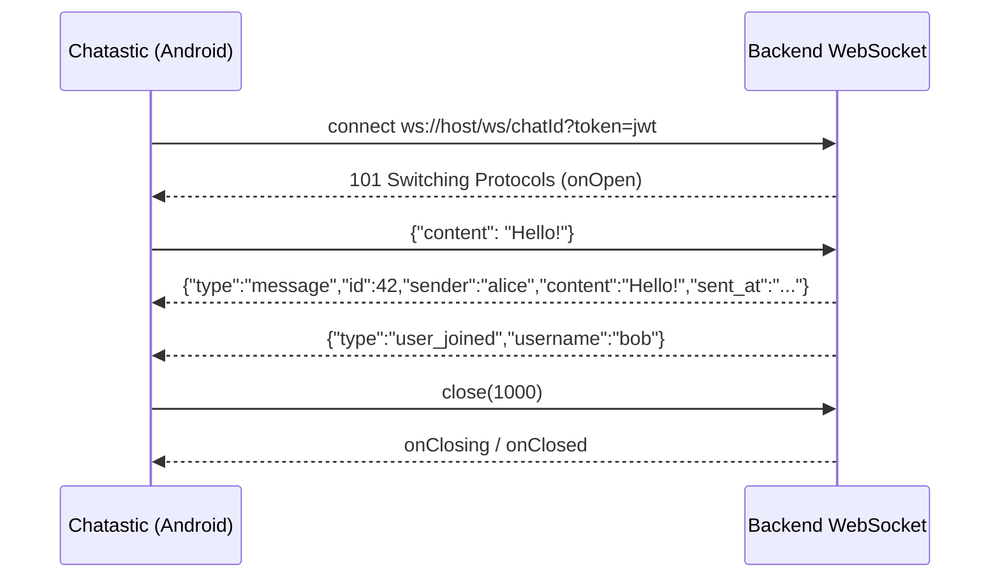

**Incoming frame types:**

| `type` | Fields | Client action |
|--------|--------|---------------|
| `message` | `id`, `sender`, `content`, `sent_at` | deserialise to `Message`, add to adapter |
| `user_joined` | `username` | currently ignored |
| `user_left` | `username` | currently ignored |

**Outgoing frame:**

```json
{ "content": "message text" }
```

The backend derives the sender from the JWT — no sender field is needed in the outgoing payload.

**Field name discrepancy between REST and WebSocket:**

```mermaid
flowchart LR
    REST[REST GET /messages\nreturns sender_username] --> Model[Message.java\n@SerializedName on both fields\ngetSenderUsername returns\nfirst non-null]
    WS[WebSocket broadcast\nreturns sender] --> Model
    Model --> Adapter[MessageAdapter\nworks identically\nfor both sources]
```
